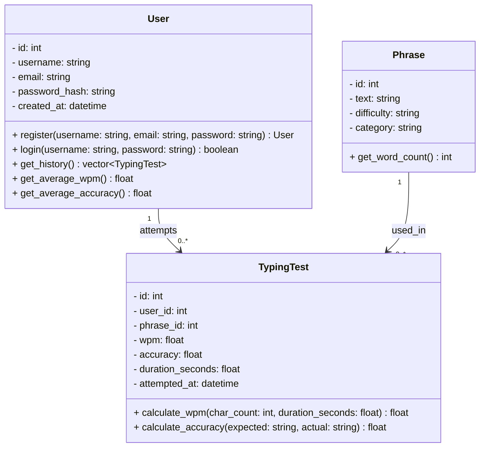

# TippityTappity

A typing practice application that tests your accuracy and speed across a wide range of phrases covering letters, numbers, and symbols.

## Features

- **Accuracy Testing** — Measure how precisely you type a given phrase
- **Speed Testing** — Track your words per minute (WPM)
- **Multi-user Support** — Each user has their own account and progress history
- **Test History** — Every attempt is saved so users can monitor improvement over time

---

## Data Model

### Entity Descriptions

**User** — Represents a registered account. Stores credentials and provides methods to retrieve personal test history and aggregate performance stats.

**Phrase** — A prompt presented to the user during a typing test. Phrases vary by difficulty (e.g. easy, medium, hard) and category (e.g. letters-only, numbers, symbols, mixed) to exercise different typing skills.

**TypingTest** — A single recorded attempt by a user on a phrase. Captures the WPM, accuracy percentage, total duration, and timestamp of the attempt.

---

## Relationships

| Relationship | Description |
|---|---|
| User → TypingTest | A user can have zero or more test attempts |
| Phrase → TypingTest | A phrase can appear in zero or more test attempts |
